# Advanced Lane Finding

## The Project

The goals / steps of this project are the following:

* Compute the camera calibration matrix and distortion coefficients given a set of chessboard images.
* Apply a distortion correction to raw images.
* Use color transforms, gradients, etc., to create a thresholded binary image.
* Apply a perspective transform to rectify binary image ("birds-eye view").
* Detect lane pixels and fit to find the lane boundary.
* Determine the curvature of the lane and vehicle position with respect to center.
* Warp the detected lane boundaries back onto the original image.
* Output visual display of the lane boundaries and numerical estimation of lane curvature and vehicle position.

# Writeup

The notebook where all the code lives can be found [here](https://github.com/rkipp1210/advanced-lane-lines/blob/master/advanced-lane-detection.ipynb).

## Camera Calibration

### Chessboard images

There were test images provided that had various angles of the chessboard image on a wall. These images were fed into a pipeline which used the OpenCV function `findChessboardCorners` to find the corners of the chessboard. Like so:

```python
ret, corners = cv2.findChessboardCorners(gray, (9,6), None)
```

Where `gray` is the grayscale image of the chessboard, and `(9, 6)` are the number of horizontal and vertical squares in the chessboard. Here's the output of finding the chessboard corners on the images:


Note that if the images are blank, then the `findChessboardCorners` didn't return any points.

If the corners were found, they were added to a list of all the corners. The list of these image points and a list of the object points are passed into the `calibrateCamera` function to get the camera distortion coefficients. The matricies calculated here will be used throughout the rest of the project.

### Undistorting Images

We can then use the `cv2.undistort` function, passing in the camera matrix and the distortion matrix, on an image to calculate the undistorted image. Here's the helper function I wrote to do this:

```python
def undistort(img, mtx, dist):
    undist = cv2.undistort(img, mtx, dist, None, mtx)
    return undist
```

Here's an example of an original image, and an undistorted version of that image.


## Image Pipeline

### Perspective Transform

After we have the undistorted images, we can perform a perspective transform to get a birds-eye view of the lane lines. This will help us fit polynomials to the lines later. To perform the transform, I used the cv2 `getPerspectiveTransform` and `warpPerspective` functions to first calculate the transform matrix using source and destination points, the applying that transform to a given image. Here is the helper function I wrote that accomplishes that:

```python
def warper(img):

    src = np.float32([
        [150, 720],
        [590, 450],
        [690, 450],
        [1150, 720]
    ])
    dst = np.float32([
        [250, 720],
        [250, 0],
        [1035, 0],
        [1035, 720]
    ])

    # Compute and apply perpective transform
    img_size = (img.shape[1], img.shape[0])
    M = cv2.getPerspectiveTransform(src, dst)
    warped = cv2.warpPerspective(img, M, img_size, flags=cv2.INTER_NEAREST)  # keep same size as input image

    return warped
```

I tuned these source and destination points on straight lane test images. And here's what the output looks like on straight lines (with the points drawn):

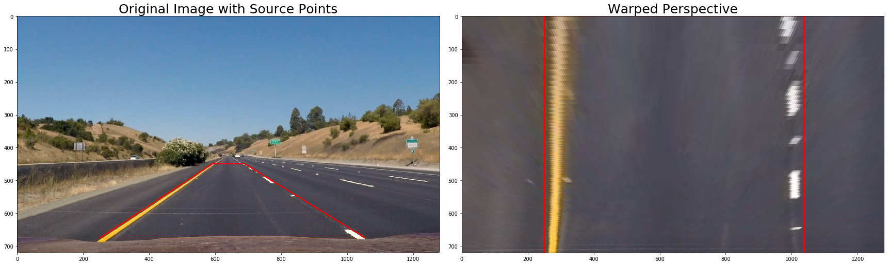
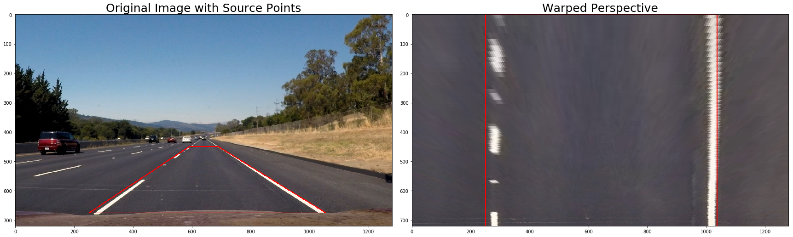

And here's what those same points look like on curved lane lines:

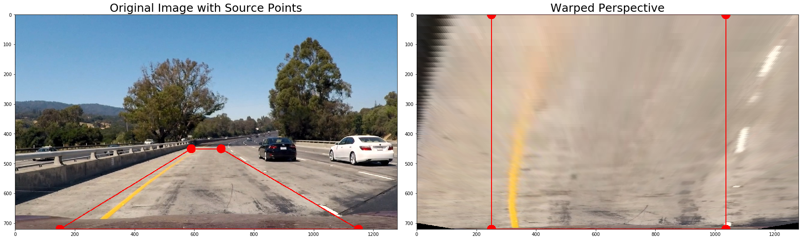
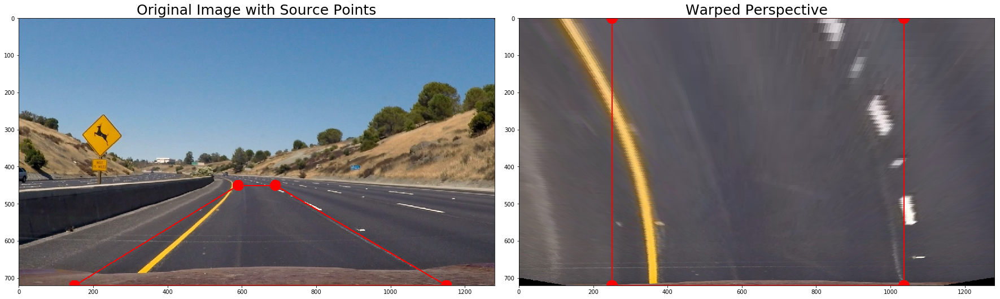

### Threshold Binary Images

I spent a lot of time reviewing which color channels were the best at pulling out the lane lines in the test images. There are many examples of this work in the ipython notebook, but here's an example:

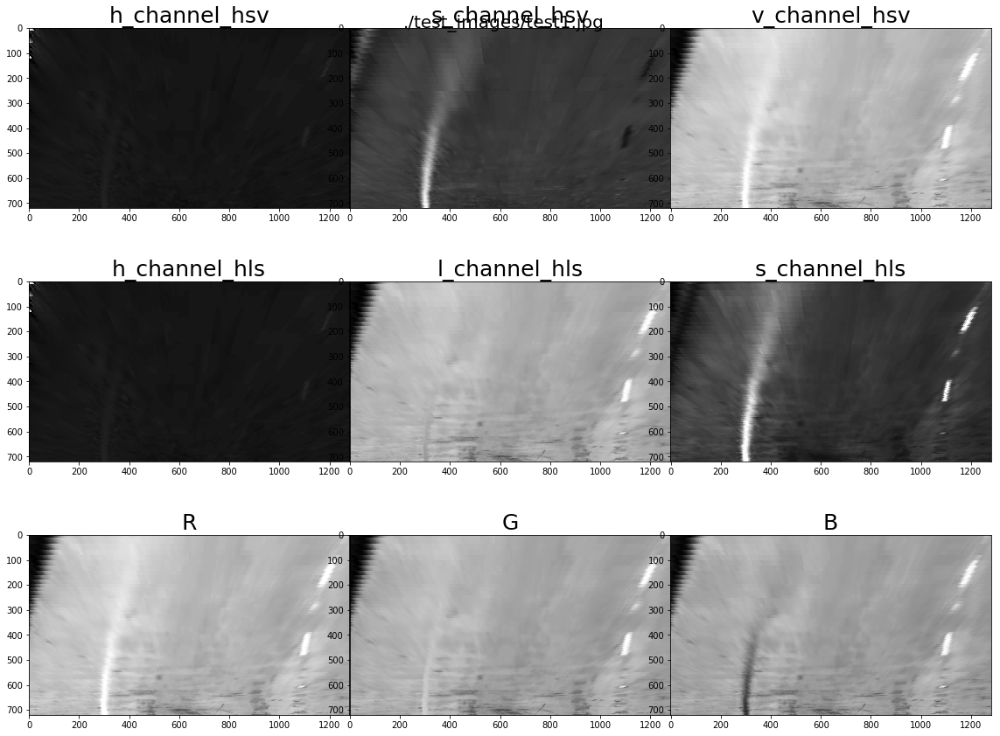

From studying these images, I eliminated a few options. I moved on to creating threshold binary images from the images that looked the best (HLS L and S channels, HSV V channel, and R from RGB). I tuned the thresholding until I was able to capture just the pixels of interest. I also did this with the Sobel operator and found that the X direction derivatives seemed the best. After running through many iterations I use the R from RGB and the Sobel X to generate my binary threshold image. Here's an example of that image pipeline:

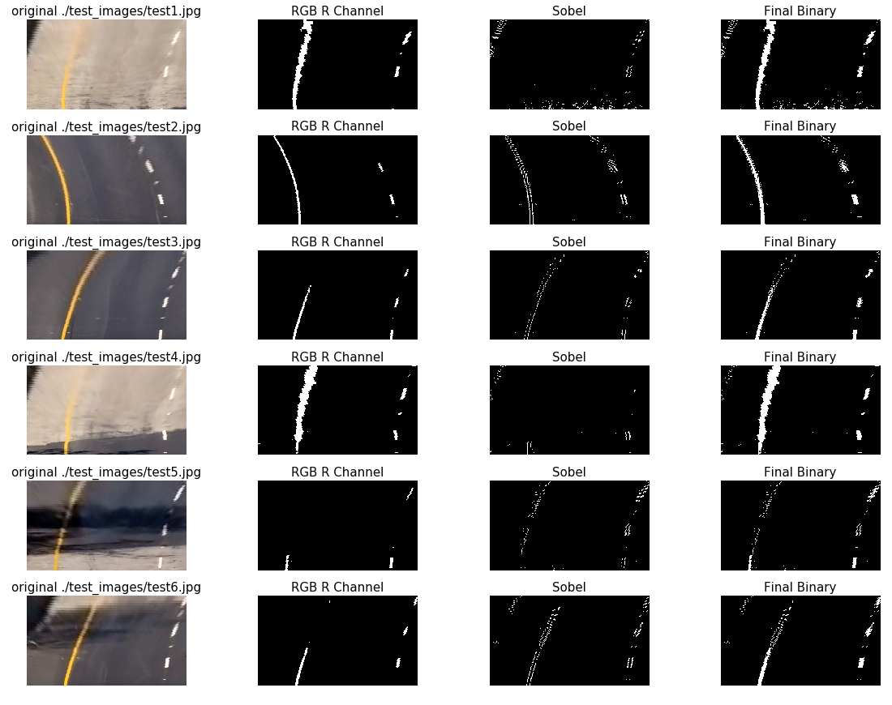

The code for everything can be found in the notebook. But here's my binary pipeline function.

```python
def binaryPipe(img):

    # Copy the image
    img = np.copy(img)

    # Undistort the image based on the camera calibration
    undist = undistort(img, mtx, dist)

    # warp the image based on our perspective transform
    warped = warper(undist)

    # Get the Red and saturation images
    red = rgb_rthresh(warped, thresh=(225, 255))

    # Run the sobel magnitude calculation
    sobel = calc_sobel(warped, sobel_kernel=15,  mag_thresh=(50, 220))

    # combine these layers
    combined_binary = np.zeros_like(sobel)
    combined_binary[ (red == 1) | (sobel == 1) ] = 1

    return combined_binary
```

### Finding Lane Line Pixels and Fitting

```
Describe how (and identify where in your code) you identified lane-line pixels and fit their positions with a polynomial?

Methods have been used to identify lane line pixels in the rectified binary image. The left and right line have been identified and fit with a curved functional form (e.g., spine or polynomial). Example images with line pixels identified and a fit overplotted should be included in the writeup (or saved to a folder) and submitted with the project.
```

The step where I find the lane lines and fit a polynomial to the lines takes in the warped, binary threshold image. If we don't have any previous fit data, then I first take a histogram of the bottom half of the warped, binary threshold image. This will identify where the most "hot" pixels are and I select a window around these points (+/- 100 px of the maximum). There are 9 windows, so each window is 80px tall for these images (720 / 9). For each window, I pull out all the pixels from the binary threshold image that are "on", and add them to the list of indicies. For the next window, I use the average of the current "on" pixels to be the middle of the next window. At the end, I fit a polynomial through all the pixels that were found in the windows and were "on".  Here's an example image from that process:

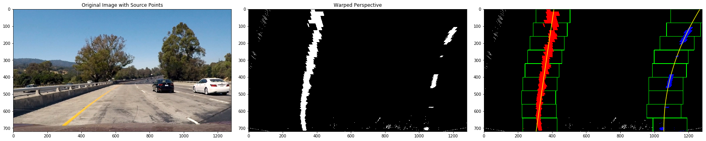

For a previous fit, the window is the previous fit +/- 100 px so it's a polynomial window. I pull out all the "on" pixels from this window and fit a polynomial through those points.

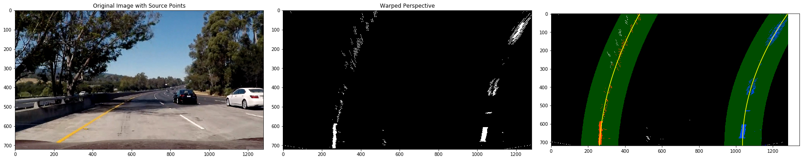

### Calculating Corner Radius and Lane Center

The radius of curvature is calculated using the equations provided in the lecture. I convert the fits to meters when I perform the fits, so I don't have to do it in my radius calculation. The radius of curvature calculation is a part of the Line class, and here is that code:

```python
def calc_radius(self):
    """
    best_fit_m is assumed to already be in meters
    """
    y_eval = self.y_eval
    fit = self.best_fit_m

    curve_rad = ((1 + (2*fit[0]*y_eval + fit[1])**2)**1.5) / np.absolute(2*fit[0])
    self.radius_of_curvature = curve_rad
    return
```

For finding the lane center I evaluate the fits at the bottom of the image, then compare those to the center of the image (which is assumed to be in the center of the lane when the care is centered in the lane).

```python
def calc_center_dist(self):
    """
    calculate the distance of this line to the center of the image (where the camera is)
    """
    # meters per pixel in x dimension
    xm_per_pix = 3.7/700

    y = self.y_eval
    x0 = self.best_fit_px[0]*(y**2) + self.best_fit_px[1]*y + self.best_fit_px[2]
    lane_to_camera_px = abs(self.camera_position - x0)
    self.lane_to_camera = lane_to_camera_px * xm_per_pix
    return
```

Then I compare the left and right distances to get the distance to the center of the image:

```python
def get_center_dist(leftLine, rightLine):

    x_left = leftLine.lane_to_camera
    x_right = rightLine.lane_to_camera

    return x_right - x_left
```


### Final Product

Using all of the above functions to assemble the final pipeline gives this result:

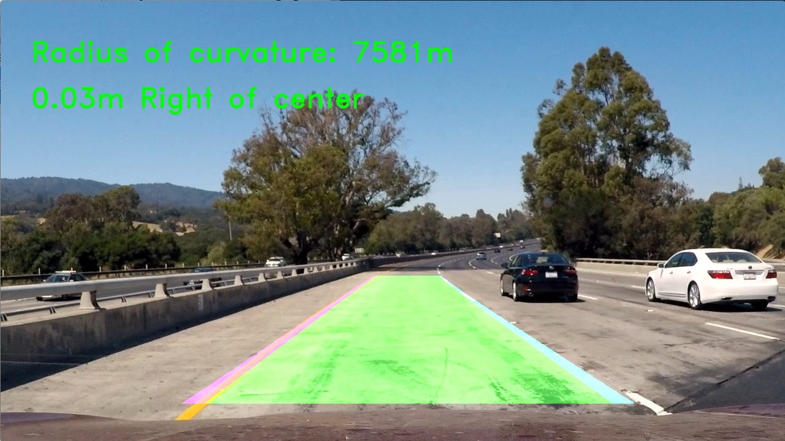
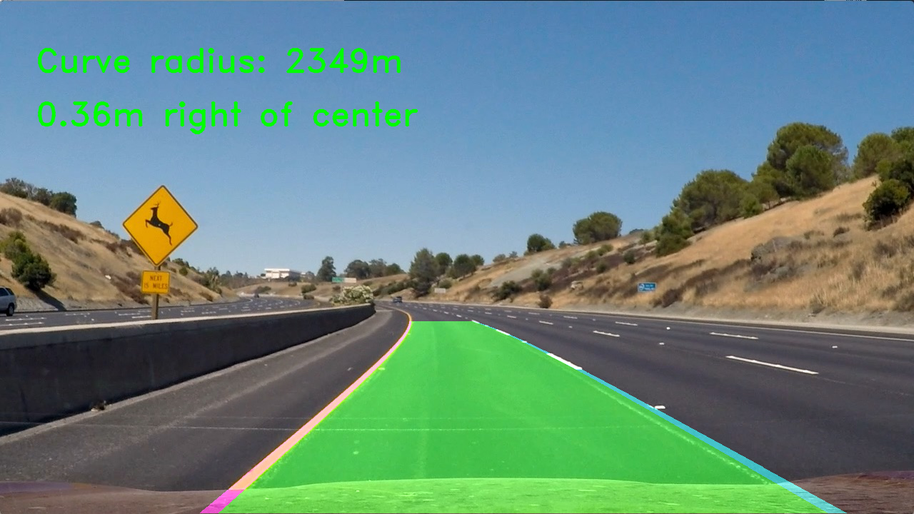
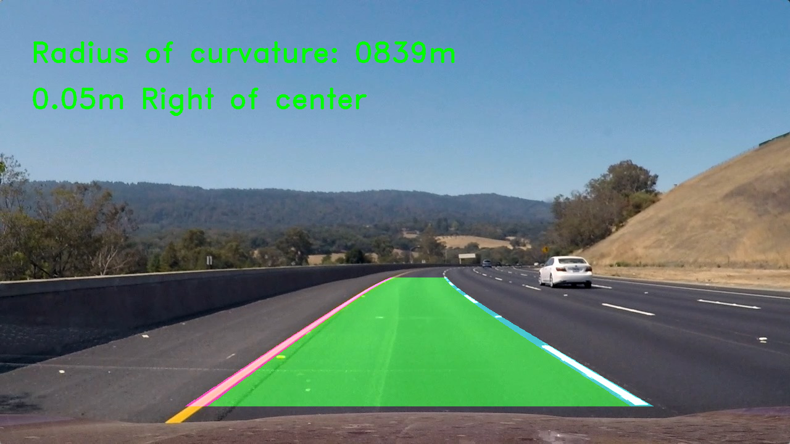
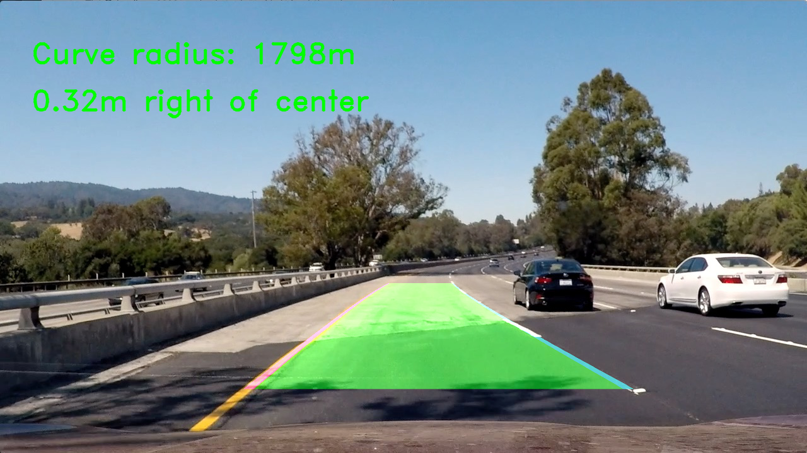
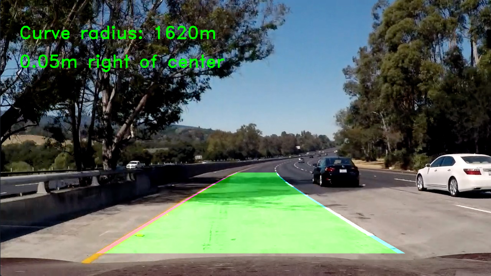
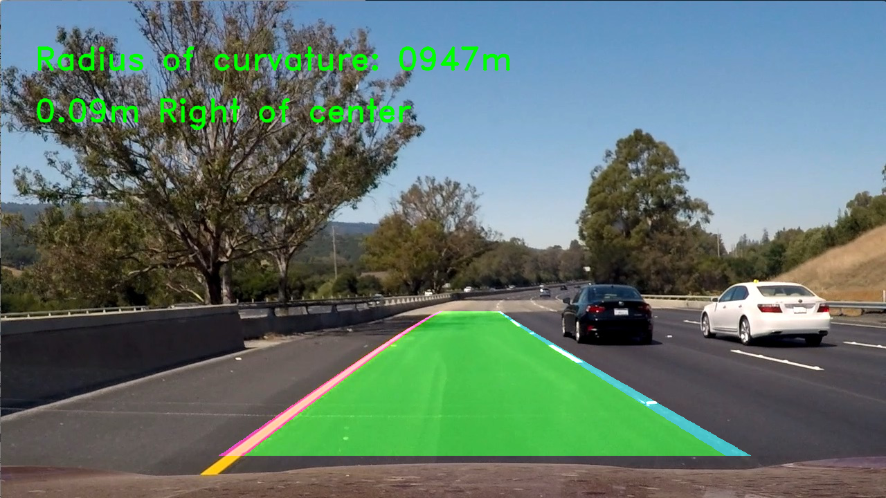


## Video

To process the video, I created a Line class that keeps track of previous fits and performs calculations for the current line fits (radius calculation, center of lane distance). It uses an average of the last n nuber of fits (n <= 5) for the "best fit". If we found a fit in the previous frame, then we use the simplified fitting process. If a fit is too different from the previous fit, then we categorize it as a bad fit and fall back on the more robust fitting mechanism on the next iteration.

The video is here: https://github.com/rkipp1210/advanced-lane-lines/blob/master/output_video/project_video_output.mp4


## Discussion

My solution works well on the project video, but really shows some weakness on the more advanced videos. This leads me to believe that I could spend more time tuning which color channels and other operators and thresholds to use for my binary image creation, as it seems so struggle a little with some of the bright and shadowed areas.  I also think that moving the warping points from image to image might help. It seems that with some images, the curves start to go out of the image, or start much farther to the left/right from previous fits.
