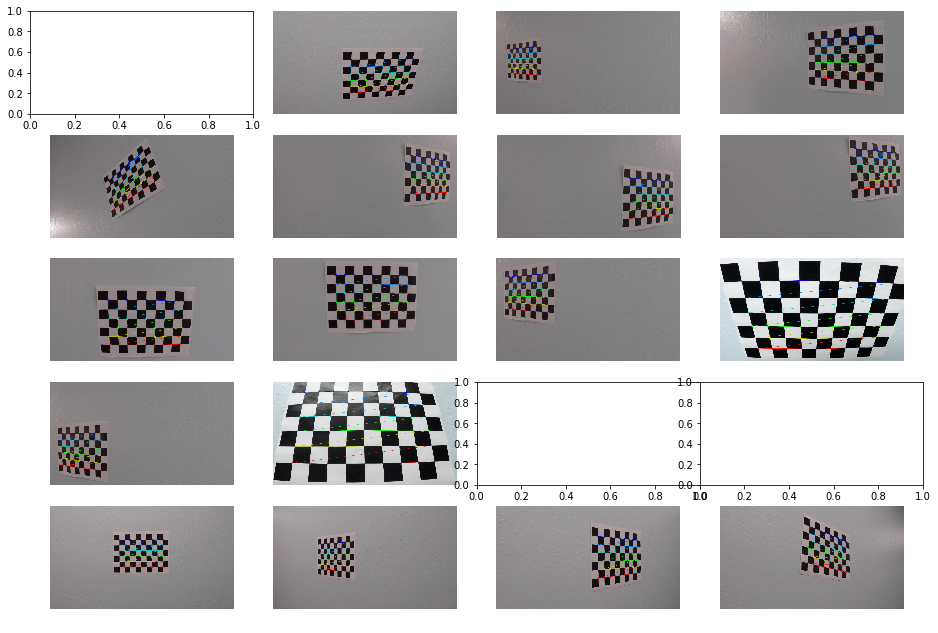
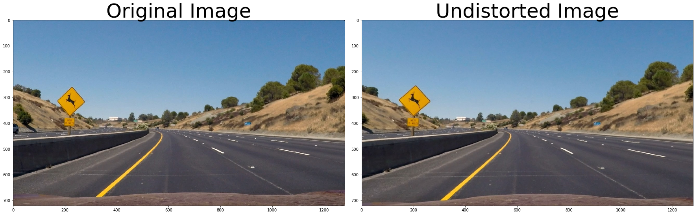

## Advanced Lane Finding

Creating a great writeup:
---
A great writeup should include the rubric points as well as your description of how you addressed each point.  You should include a detailed description of the code used in each step (with line-number references and code snippets where necessary), and links to other supporting documents or external references.  You should include images in your writeup to demonstrate how your code works with examples.  

All that said, please be concise!  We're not looking for you to write a book here, just a brief description of how you passed each rubric point, and references to the relevant code :).

You're not required to use markdown for your writeup.  If you use another method please just submit a pdf of your writeup.

The Project
---

The goals / steps of this project are the following:

* Compute the camera calibration matrix and distortion coefficients given a set of chessboard images.
* Apply a distortion correction to raw images.
* Use color transforms, gradients, etc., to create a thresholded binary image.
* Apply a perspective transform to rectify binary image ("birds-eye view").
* Detect lane pixels and fit to find the lane boundary.
* Determine the curvature of the lane and vehicle position with respect to center.
* Warp the detected lane boundaries back onto the original image.
* Output visual display of the lane boundaries and numerical estimation of lane curvature and vehicle position.

To help the reviewer examine your work, please save examples of the output from each stage of your pipeline in the folder called `ouput_images`, and include a description in your writeup for the project of what each image shows.    The video called `project_video.mp4` is the video your pipeline should work well on.  

The `challenge_video.mp4` video is an extra (and optional) challenge for you if you want to test your pipeline under somewhat trickier conditions.  The `harder_challenge.mp4` video is another optional challenge and is brutal!

If you're feeling ambitious (again, totally optional though), don't stop there!  We encourage you to go out and take video of your own, calibrate your camera and show us how you would implement this project from scratch!

## Writeup
---

### Camera Calibration

#### Chessboard images

There were test images provided that had various angles of the chessboard image on a wall. These images were fed into a pipeline which used the OpenCV function `findChessboardCorners` to find the corners of the chessboard. Here's the output of finding the chessboard corners on the images:

Note that if the images are blank, then the `findChessboardCorners` didn't return any points.

If the corners were found, they were added to a list of all the corners. The list of these image points and a list of the object points are passed into the `calibrateCamera` function to get the camera distortion coefficients. The matricies calculated here will be used throughout the rest of the project.

#### Undistorting Images

We can then use the `cv2.undistort` function, passing in the camera matrix and the distortion matrix, on an image to calculate the undistorted image. Here's an example of an original image, and an undistorted version of that image.

### Image Pipeline
